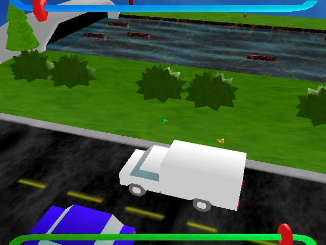



## Frog3D \- 3D frogger game

### Description

Frog3D is a 3D frogger game, with DirectX graphics and sound. The goal of the game is to get the frog across the road without becoming road pizza, and get him across the pirahna-infested river.

I spent more than 4 months on this game that I made about a year ago, and hopefully you will be able to learn something from it.

If you have any problems downloading this, you can get it also at

http://gamesoft.dyndns.org/frog3d/f3d_src_psc.zip

I'm hoping to get Code of the Month with this game, so please vote for this game!
 
### More Info
 

             |
---                |---
**Submitted On**   |2005-01-26 18:51:30
**By**             |[Marshall H\.](https://github.com/Planet-Source-Code/PSCIndex/blob/master/ByAuthor/marshall-h.md)
**Level**          |Advanced
**User Rating**    |5.0 (223 globes from 45 users)
**Compatibility**  |VB 5\.0, VB 6\.0
**Category**       |[Games](https://github.com/Planet-Source-Code/PSCIndex/blob/master/ByCategory/games__1-38.md)
**World**          |[Visual Basic](https://github.com/Planet-Source-Code/PSCIndex/blob/master/ByWorld/visual-basic.md)
**Archive File**   |[Frog3D\_\-\_31844541262005\.zip](https://github.com/Planet-Source-Code/marshall-h-frog3d-3d-frogger-game__1-58515/archive/master.zip)

